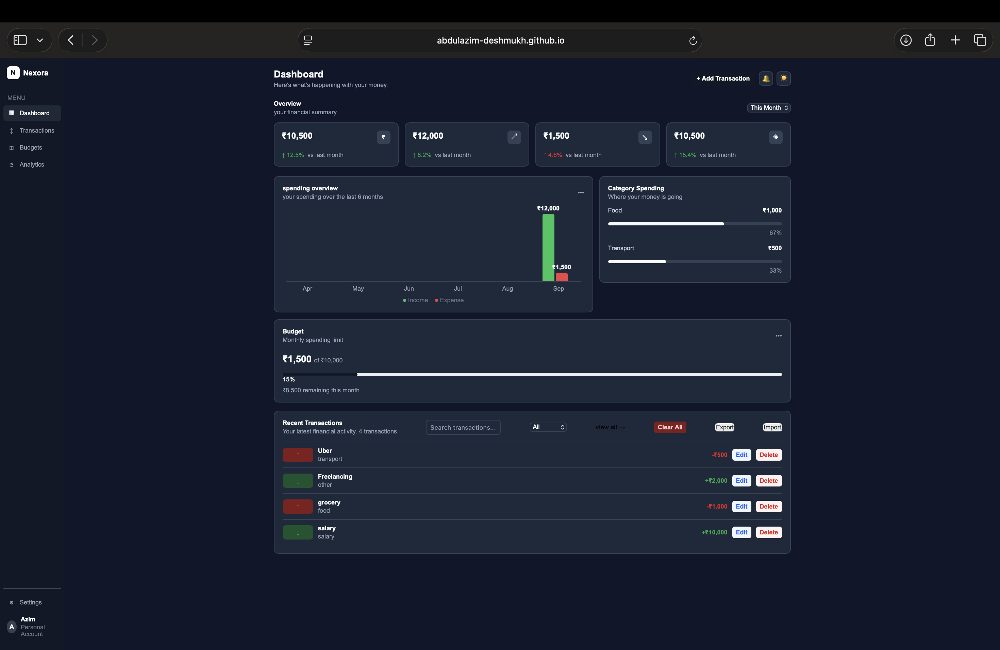
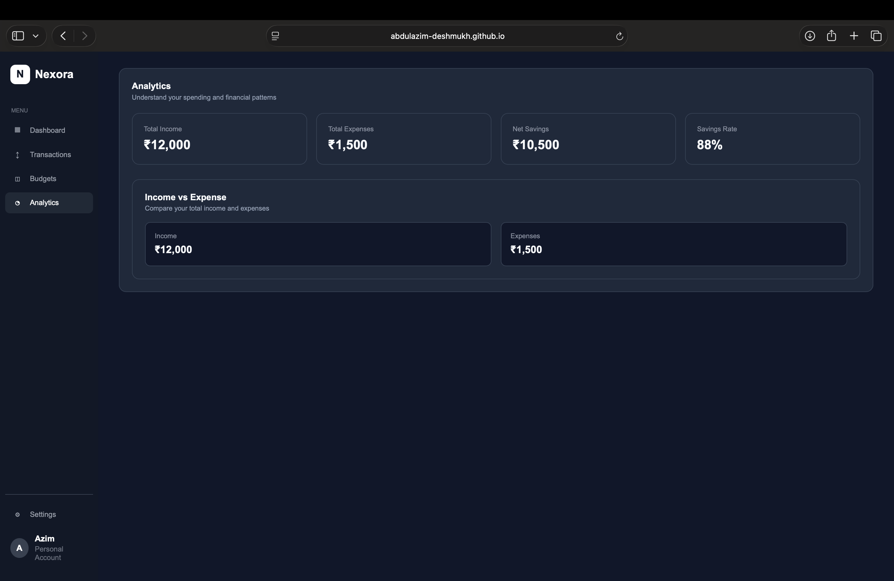
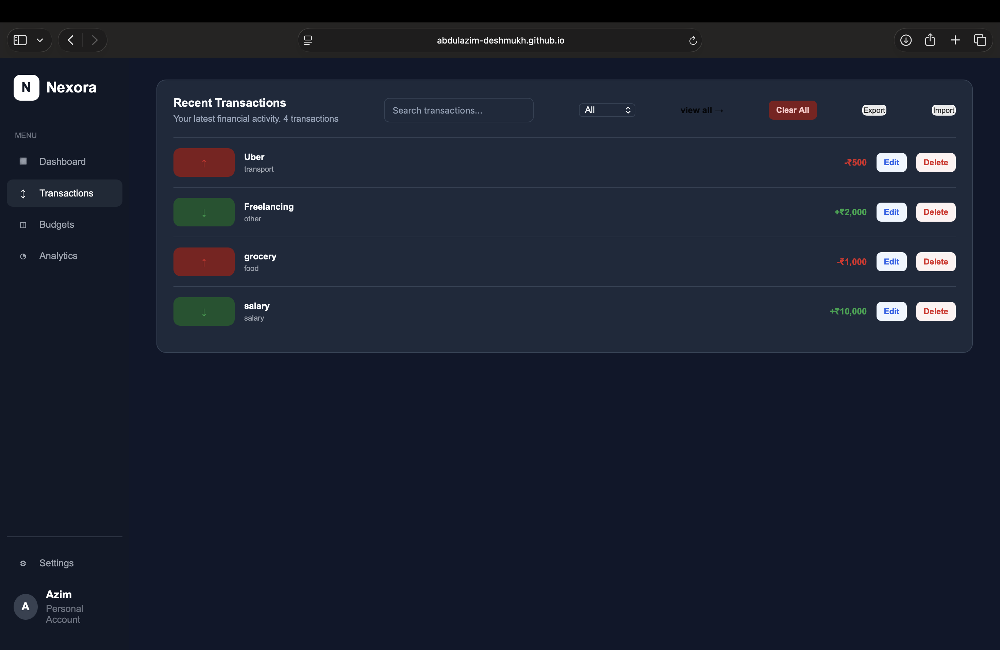
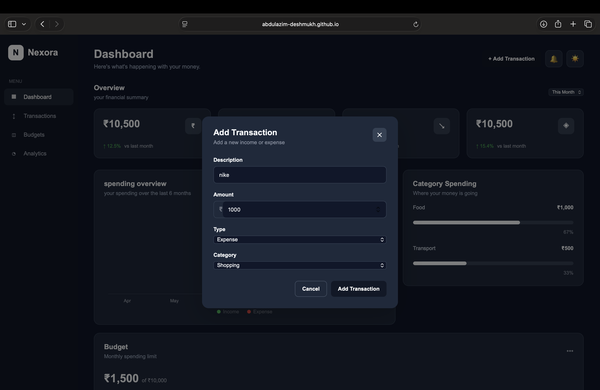

# Nexora — Personal Finance Dashboard

Nexora is a responsive personal finance dashboard built with HTML, CSS, and JavaScript.

It allows users to manage their income and expenses, track their budget, analyze spending, and store transaction data directly in the browser.

## Features

- Add, edit, and delete transactions
- Income and expense tracking
- Automatic financial summary
- Search transactions
- Filter by transaction type
- Monthly budget tracking
- Spending by category
- Financial analytics
- Income vs expense chart
- Export transactions to CSV
- Import transactions from CSV
- Dark and light mode
- Personal account/profile
- Data persistence using localStorage
- Responsive dashboard layout

## Technologies Used

- HTML5
- CSS3
- JavaScript
- Browser localStorage
- CSV / Blob API

## Screenshots

### Dashboard


### Analytics


### Transactions


### Add Transaction



## Project Structure

```text
nexora-finance-dashboard/
├── index.html
├── css/
│   └── style.css
├── js/
│   └── app.js
└── assets/